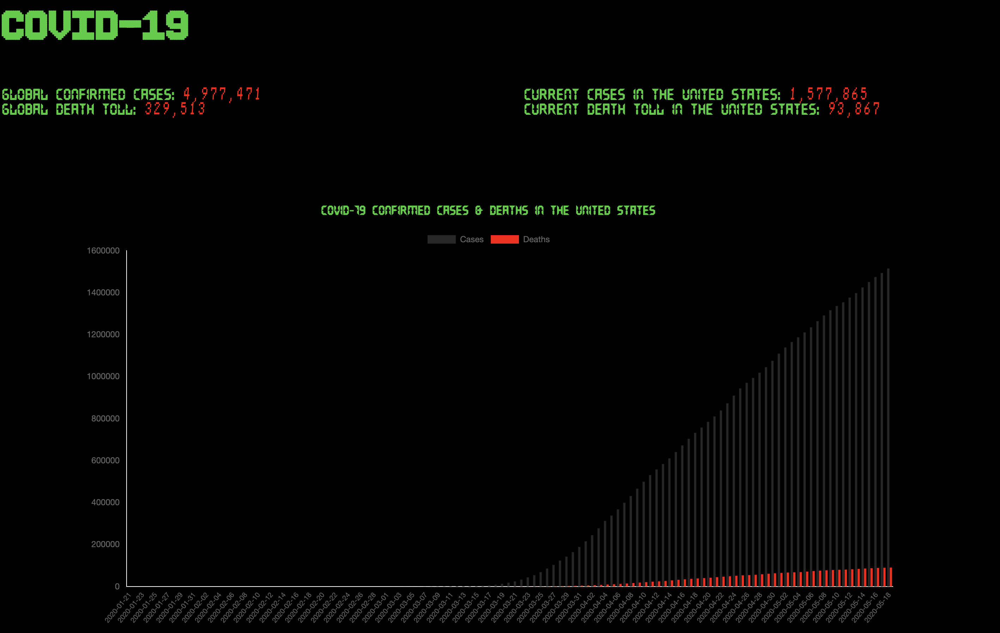
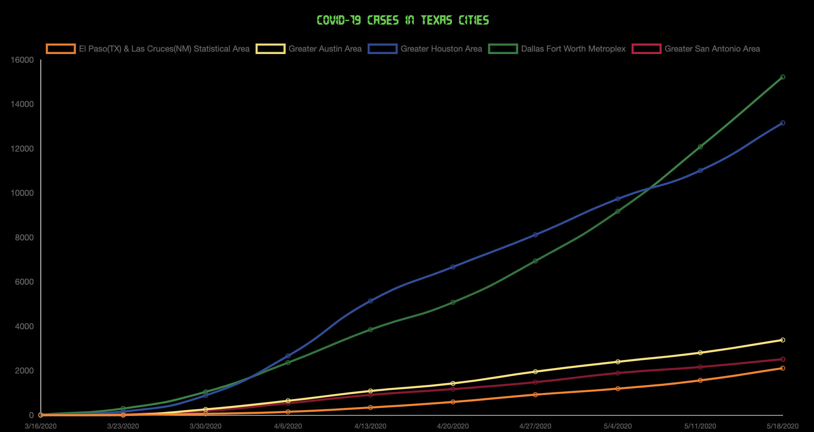

# COVID-19-Visualizer

A simple app that pulls COVID-19 confirmed cases and deaths from 2 APIs. In addition the graphs pull from a local csv with the US graph updating daily and the Texas one being updated manually every Tuesday.

